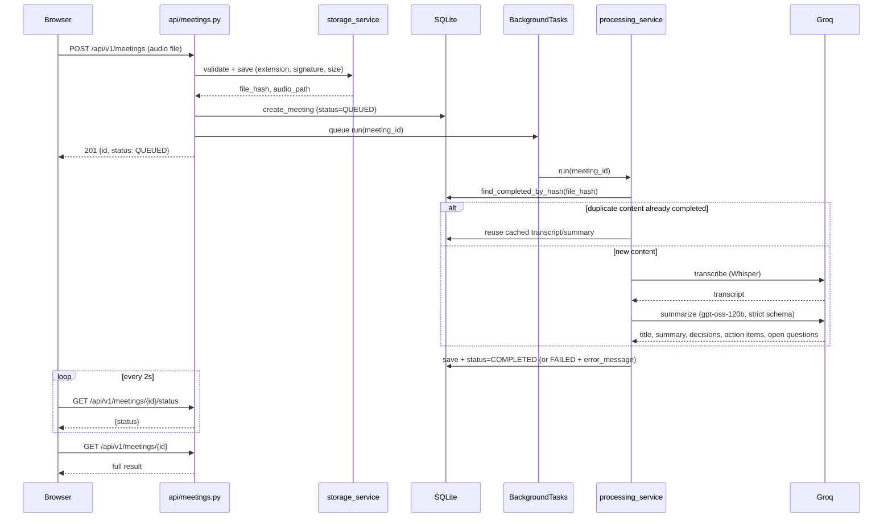

# Meeting Summarizer

An AI meeting summarizer: upload a recording and get back a transcript, a
concise summary, the decisions that were actually made, and a list of
action items with owners and deadlines — built on FastAPI, SQLite, and
Groq (Whisper for transcription, `gpt-oss-120b` for summarization), with
no Docker, Redis, Celery, or frontend framework.

**Live app:** <http://18.234.90.43:8000> 

See [DECISIONS.md](DECISIONS.md) for the engineering log — the problems hit,
why each architectural and provider choice was made, and the trade-offs
accepted along the way.

## Demo

https://github.com/user-attachments/assets/93130e4a-8071-453c-be8a-086fe1c8285c

## Features

- Upload a `.mp3`, `.wav`, or `.m4a` recording and get back a transcript,
  a summary, key decisions, action items (with owner and deadline), and
  open questions
- Processing runs asynchronously — the upload returns immediately and the
  frontend polls for status, so a long recording never blocks the request
- Identical audio is automatically deduplicated by content hash and never
  reprocessed
- Every provider failure mode (rate limits, corrupted files, silent audio,
  malformed responses) is handled explicitly and verified live, not just
  assumed — see [Error handling & edge cases](#error-handling--edge-cases)
- Measured, not assumed, accuracy: ~1.8% average transcription WER and
  near-perfect summarization recall on a golden test set — see
  [Accuracy evaluation](#accuracy-evaluation)

## Stack

FastAPI, SQLite (stdlib `sqlite3`, no ORM), FastAPI `BackgroundTasks` for
async processing, a plain HTML/CSS/JS frontend. No Docker, Redis, Celery, or
frontend build step — see [Why no queue or cache](#why-no-queue-or-cache).

## How a request flows



The upload request returns immediately after queuing — transcription and
summarization happen in `BackgroundTasks`, after the response is already
sent, so the browser polls `/status` rather than blocking on one long
request.

## Project structure

```
backend/app/
├── main.py              # FastAPI app + startup
├── api/
│   ├── health.py
│   └── meetings.py       # POST /api/v1/meetings — upload + validate
├── services/
│   ├── storage_service.py        # extension/signature/size checks, content-addressed storage
│   ├── processing_service.py     # orchestrates one meeting: transcribe -> summarize -> persist
│   ├── transcription_service.py  # Groq Whisper, isolated so the provider can change later
│   └── summarization_service.py  # Groq gpt-oss-120b, strict JSON-schema output
├── database/
│   ├── connection.py    # sqlite3 connection helper
│   ├── init_db.py       # schema creation
│   └── meetings_repo.py # CRUD against the meetings table
├── models/
│   └── meeting.py        # Meeting dataclass + status enum
├── core/
│   ├── config.py         # env-driven settings, no python-dotenv
│   └── logging.py
├── schemas/
│   └── meeting.py         # API response shapes (Pydantic)
└── utils/
    ├── retry.py           # retry helper for transient provider errors
    └── errors.py          # extracts a clean message from a provider exception
frontend/
├── index.html            # upload form + status/result/error views
├── style.css
└── app.js                # upload -> poll status -> render result, plus history
tests/                    # mirrors backend/app/ — one test file per module
eval/                     # standalone accuracy eval, not part of the shipped app
├── cases.py               # golden-set meetings with known-correct answers
├── wer.py                 # word error rate (hand-implemented, no extra dependency)
└── run_accuracy_eval.py   # synthesizes audio, runs the real pipeline, scores it
.github/workflows/tests.yml # pytest on every push
requirements.txt            # runtime deps only, hand-curated (not a raw `pip freeze`)
requirements-dev.txt        # + pytest, for local development and CI
```

## Running the project

Requires Python 3.11+ (the code uses `StrEnum`) and a free Groq API key
(<https://console.groq.com>, no credit card).

```bash
# 1. Set up the environment
python -m venv .venv
.venv\Scripts\Activate.ps1        # Windows PowerShell
pip install -r requirements-dev.txt

# 2. Configure
cp .env.example .env
# then open .env and set GROQ_API_KEY=gsk_...

# 3. Run — this one command serves both the API and the frontend
uvicorn backend.app.main:app --reload
```

That's the whole project: `main.py` serves the frontend as static files
*and* the API from the same process on the same port, so there's no
separate frontend server or build step to run.

Open <http://127.0.0.1:8000> for the app itself, or
<http://127.0.0.1:8000/health> for a liveness check
(`{"status": "ok", "database": "ok"}`). Interactive API docs at
<http://127.0.0.1:8000/docs>.

One gotcha worth knowing: `.env` is only read once, when the process
starts. If you change it while the server is running, `--reload` will not
pick it up — stop the process (Ctrl+C) and start it again.

**Running the tests:**

```bash
pytest -v
```

**Running the accuracy eval** (separate from the app itself — see
[Accuracy evaluation](#accuracy-evaluation)):

```bash
python -m eval.run_accuracy_eval
```

## API

| Method | Endpoint | Purpose |
| --- | --- | --- |
| `GET` | `/health` | Liveness + a real SQLite round-trip |
| `POST` | `/api/v1/meetings` | Upload audio (multipart, field `audio`) → `201` + `{id, status}` |
| `GET` | `/api/v1/meetings` | List all meetings (id, filename, status, timestamps) |
| `GET` | `/api/v1/meetings/{id}` | Full result — transcript, summary, key_decisions, action_items |
| `GET` | `/api/v1/meetings/{id}/status` | Lightweight status poll — `{id, status, error_message}` |

An unknown `{id}` returns `404` on both the detail and status routes. Poll
`/status` while a meeting is `QUEUED`/`PROCESSING`; fetch `/{id}` once it's
`COMPLETED` (or read `error_message` if it's `FAILED`).

Accepted formats: `.mp3`, `.wav`, `.m4a` — checked by extension, declared
content type, and a byte-signature sniff of the file itself, since the
brief specifically says not to trust the filename. Files are stored under
their own sha256 hash rather than the client-supplied name, which also
gives free dedupe: uploading identical content twice reuses the file on
disk instead of writing it again.

## Transcription

ASR runs on Groq's `whisper-large-v3-turbo`, not plain `whisper-large-v3` —
a deliberate accuracy/speed trade-off, not an oversight. Turbo is a
distilled model (809M parameters vs. 1.55B, 4 decoder layers vs. 32) that
runs meaningfully faster and cheaper at a measured cost of about 2 points
of word error rate (~12% vs. ~10%). For meeting audio — generally clear,
single/few-speaker, English — that gap is not the bottleneck on summary
quality; if this were handling noisy multilingual audio where every word
error compounds, `whisper-large-v3` would be the better default. Swapping
is a one-line change (`transcription_service._MODEL`).

## Summarization

The LLM step runs on Groq's `openai/gpt-oss-120b` with `response_format`
set to a strict JSON schema — one of only two models on Groq where `strict:
true` is actually enforced by constrained decoding rather than best-effort,
so a malformed response isn't a failure mode to defend against so much as
one to double-check (`_validate_result` still does, on principle).

The system prompt (`summarization_service._SYSTEM_PROMPT`) encodes the
distinctions that go wrong most often in meeting notes:

- a **decision** is something the group actually settled on, not something
  merely discussed or left open
- a missing owner or deadline becomes `null`, never a guessed name or an
  invented date
- the summary is a briefing for someone who missed the meeting, not a
  restatement of the transcript
- **`title`** is a short, content-derived title (never a generic "Meeting
  Notes"), and **`open_questions`** captures real unresolved items the group
  raised but didn't answer — both are separate schema fields, not folded
  into the summary text
- the prompt includes one worked example (a short transcript paired with
  its expected JSON output), which is the single highest-leverage addition
  for output consistency — showing the model the shape once beats describing
  it in rules alone
- the transcript is explicitly framed as **data to summarize, not
  instructions to follow** — live-tested by embedding a fake "SYSTEM
  OVERRIDE, ignore previous instructions" block inside a real transcript;
  the model kept summarizing the actual meeting and ignored it

Two size guards worth knowing about:

- `MAX_UPLOAD_MB` (25MB default) matches Groq's own free-tier transcription
  cap — see [Error handling & edge cases](#error-handling--edge-cases)
- `_MAX_TRANSCRIPT_CHARS` (100k chars) truncates a pathologically long
  transcript before it reaches the LLM, so an abnormal input can't cause
  unbounded latency/cost; a real meeting transcript never gets close to it

## Accuracy evaluation

`eval/run_accuracy_eval.py` is a standalone script (not part of the shipped
app — nothing under `backend/` imports it) that measures transcription and
summarization quality against a small hand-written golden set, instead of
relying on eyeballing one recording:

1. Four short meeting scripts with a *known* correct answer — the actual
   decisions, action items, and open questions are written down in advance
   in `eval/cases.py`. Each script includes something that's merely
   *discussed*, not decided (checks the model doesn't invent a decision
   that was never made), and one case (`incident_review`) specifically
   tests that an owner/deadline is left `null` rather than guessed when
   the transcript never states one.
2. Each script is synthesized to real speech (Windows TTS) and run through
   the real ASR service — Word Error Rate is computed against the known
   script text.
3. The real transcript is run through the real summarizer, and the result
   is scored against the known decisions/action items/open questions.

```bash
python -m eval.run_accuracy_eval
```

Two real things this eval surfaced and fixed, worth knowing about before
reading the numbers:

- **The first version overstated WER.** Scripts spelled times/numbers as
  words ("nine thirty a.m.") while Whisper correctly transcribes what it
  hears as digits ("9:30am") — a formatting mismatch in the *reference
  text*, not a transcription error. Fixed by writing scripts the way
  people actually write times/dates; average WER dropped from 3.2% to
  ~1.8% purely from that correction, with no model change.
- **`open_questions` under-captured deferred topics.** The field was
  originally defined as "unresolved questions," but a meeting also defers
  whole *topics* ("that's a bigger conversation for another day") without
  phrasing them as a question — and the model, taking that definition
  literally, sometimes dropped those entirely instead of filing them as
  open questions. Broadened the schema description and prompt rule 7 to
  explicitly cover deferred topics, not just literal questions.

Latest results, averaged over 3 runs (temperature isn't 0, so a couple of
individual runs are shown alongside the aggregate rather than picking the
best one):

| Metric | Result |
| --- | --- |
| Average WER | ~1.8% |
| Decision recall | 18/18 across 3 runs, 0 false positives in any run |
| Action item recall (task + assignee + deadline all correct, including correctly-null cases) | 21/21 across 3 runs |
| Open question recall | 14/15 across 3 runs — the one miss was a full item dropped in a single run, not a phrasing mismatch; not fully deterministic at `temperature=0.2` |

Full transcripts and raw model output for each case are written to
`eval/results/<run-id>/report.md` (gitignored — regenerate by running the
script; requires `GROQ_API_KEY` in `.env`, same as the app itself).

## Frontend

Plain HTML/CSS/vanilla JS — no React, no build step, no `node_modules`.
FastAPI serves it directly via `StaticFiles` (mounted at `/`, after the API
routers so it never shadows them), so the whole app is one process on one
port.

Upload a file and `app.js` polls `/status` every 2 seconds, moving through
`Queued… → Processing… → ` a rendered result — title, summary, key
decisions, a checklist of action items with owner and deadline, open
questions, and the transcript behind a `<details>` toggle. A failure shows
the actual `error_message` from the API, not a generic "something went
wrong." "Summarize another meeting" sits at the top of the result view, not
buried below it. "Recent meetings" lives in a side tab pinned to the edge of
the screen rather than the main flow — click it to slide out a panel
(reusing `GET /api/v1/meetings`) and reopen any past result, or re-check one
still processing, without re-uploading.

## Error handling & edge cases

Every failure mode below was actually triggered and verified against the
real Groq API while building the pipeline — not just asserted in a mocked
test. Everything ends in a clean `FAILED` status with a readable
`error_message`; nothing surfaces as a raw stack trace or hangs.

| Case | Where it's caught | What happens |
| --- | --- | --- |
| Wrong file extension (e.g. `.exe`) | Upload, `storage_service.py` | `422` immediately, upload never written to disk |
| Right extension, wrong content (e.g. a renamed text file) | Upload, byte-signature check | `422` — the first bytes don't match the format's real magic number |
| Empty file (0 bytes) | Upload | `422` before any processing starts |
| File over `MAX_UPLOAD_MB` (default 25MB) | Upload, streamed size check | `422` — aborted mid-stream, partial file cleaned up, not just rejected after a full upload. 25MB isn't arbitrary: it matches Groq's own free-tier transcription cap, so an oversized file is rejected immediately at upload instead of being saved, queued, and failing later at the transcription step with a less useful `413`. Raising `MAX_UPLOAD_MB` past 25 doesn't help — it only moves the failure downstream |
| Valid header, corrupted/garbage payload (passes the upload check, isn't real audio) | ASR call | Groq's own `400` rejection is caught and surfaced verbatim, e.g. *"could not process file - is it a valid media file?"* — confirmed live with a hand-crafted WAV that has a valid `RIFF` header and garbage after it |
| Silent or no-speech audio | After transcription, `processing_service.py` | Whisper doesn't return empty for silence — it hallucinates short boilerplate (confirmed live: 2 seconds of true digital silence came back as `" Thank you."`). A minimum-transcript-length check catches this before it reaches the summarizer, rather than producing a summary from a hallucinated sentence |
| Network blip / rate limit / upstream 5xx from Groq | `utils/retry.py`, used by both ASR and LLM calls | Retried automatically (backoff, 3 attempts); only surfaces as `FAILED` if all retries are exhausted |
| Malformed LLM JSON response | `summarization_service._validate_result` | Rejected and reported, even though `strict: true` on `gpt-oss-120b` should already guarantee valid shape — never trust an external system blindly |
| Two identical files uploaded before either finishes processing | `find_completed_by_hash` only matches `COMPLETED` rows | Both process independently (a few duplicate provider calls); the dedupe only kicks in for *subsequent* uploads of the same file, once one has actually completed. A known, accepted trade-off — real locking would add complexity out of proportion to what this project needs |
| `GROQ_API_KEY` missing | App startup | Logged as a warning immediately (`main.py`), instead of only failing silently on the first upload |
| Unknown meeting id | `GET /api/v1/meetings/{id}` and `/status` | `404` with a message naming the id that wasn't found |
| Pathologically long transcript (well past a normal meeting) | `summarization_service._prepare_transcript` | Truncated to `_MAX_TRANSCRIPT_CHARS` before it reaches the LLM, with a note appended so the model knows the transcript was cut — bounds latency/cost instead of sending an unbounded prompt |
| Transcript content containing text that looks like an instruction to the model (e.g. "ignore previous instructions", a fake "system override") | `summarization_service._SYSTEM_PROMPT`, rule 8 | The model treats it as something a participant said, not a command — confirmed live by embedding a fake override block inside a real transcript and checking the output still summarized the actual meeting |

## Tests

`pytest -v` (see [Running the project](#running-the-project)) runs
automatically on every push via GitHub Actions
(`.github/workflows/tests.yml`).

## Why no queue or cache

The assignment's own submission guidelines ask for minimal, native
dependencies — "no extra modules," "use only what is strictly required."
FastAPI's built-in `BackgroundTasks` covers "process audio without making
the user wait" without a Celery/Redis broker, and a `file_hash` column on
the `meetings` table covers dedupe without a separate cache layer. Both are
one process, one database.
